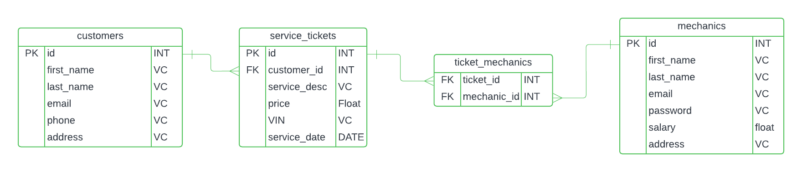

# hw17-flask-models
Using this ERD, create the foundation of your Flask API by building the database models: 

- Open VS Code to that project folder
- Inside that folder, create a virtual environment
- Activate the virtual environment
- pip install flask flask-sqlalchemy 
- Initialize your flask app app = Flask(__name__)
- Initialize sqlalchemy db = SQLAlchemy(model_class = Base)
- Build your Models, just like we did in sqlalchemy

[Lucid Chart of Mechanic Shop](https://lucid.app/lucidchart/d6cf12e2-cf21-49ae-a554-0029d64d6d46/edit?invitationId=inv_f1be1ecd-4c0a-4dce-9ad8-f9cbd0f5d415&authuser=2&page=0_0#)

[dkatina - In Class Example Repo](https://github.com/dkatina/library-api?authuser=2)

[Flask SQLAlchemy Docs](https://flask-sqlalchemy.readthedocs.io/en/stable/quickstart/?authuser=2)

